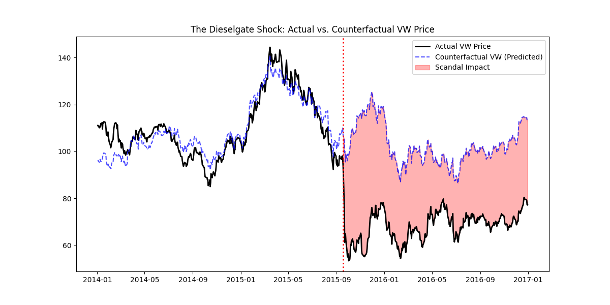
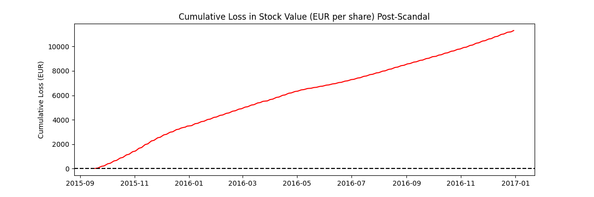

# 📉 The Cost of Lies: Causal Inference on "Dieselgate"

## 📌 Executive Summary

**The Question:**  
How much shareholder value did Volkswagen lose specifically due to the 2015 Emissions Scandal, separate from general market trends?

**The Method:**  
Synthetic Control / Counterfactual Analysis using BMW and Mercedes-Benz as control units.

**The Verdict:**  
- **Immediate Impact:** Volkswagen stock diverged ~40% from its counterfactual trend line immediately following the scandal.  
- **Long-Term Damage:** By the end of 2016, the stock failed to recover to its baseline, indicating a persistent **"Reputation Tax" of €30–€40 per share**.

---

## 💼 Business Problem

In September 2015, the EPA issued a notice of violation to the Volkswagen Group (the **"Dieselgate" Scandal**). While the stock price visibly dropped, quantifying the *true financial damage* is difficult because the entire automotive sector fluctuates daily.

A simple **Before vs. After** comparison is flawed because it ignores external factors such as:
- Market-wide downturns
- Sector-wide booms
- Macroeconomic shocks

To isolate the scandal’s actual impact, we must answer:

> **What would Volkswagen's stock price have been if the scandal never happened?**

---

## 🛠️ Technical Approach

This project applies **Causal Inference**, specifically the **Synthetic Control Method**, to construct a *Counterfactual Volkswagen*.

### 1. Data Acquisition
- **Source:** Live financial data via `yfinance` API  
- **Period:** Jan 2014 – Dec 2016 (Training on pre-scandal data)
- **Assets:**
  - **Treatment Unit:** Volkswagen (`VOW3.DE`)
  - **Control Units:** BMW (`BMW.DE`), Mercedes-Benz (`MBG.DE`)

---

### 2. Model Validation (Pre-Intervention)

We verified that BMW and Mercedes were strong predictors of VW before the scandal.

- **Correlation:**  
  \[
  R > 0.9
  \]
- **Model:**  
  Linear Regression trained on the pre-scandal period  
  \[
  VW \sim BMW + Mercedes
  \]  
  This learns the *normal market behavior* of German automakers.

---

### 3. Counterfactual Prediction

The model predicts VW’s stock price for the post-scandal period using BMW and Mercedes.

**Causal Impact = Predicted Price (Counterfactual) − Actual Price**

---

## 📊 Visualizations  
*(Generated inside the notebook)*

### 1. The Divergence (Actual vs. Counterfactual)



- Blue dashed line → **Parallel universe without the scandal**
- Black line → **Reality**
- Red gap → **Cost of the scandal**

---

### 2. Cumulative Loss per Share



Tracks aggregated shareholder value destroyed over time.

---

## 📉 Key Findings

| Metric                    | Value     | Interpretation                                                     |
|---------------------------|-----------|---------------------------------------------------------------------|
| Pre-Scandal Correlation  | 0.92       | High confidence in BMW/Mercedes as valid control units               |
| Max Divergence           | -€60.00    | Peak difference between expected and actual share price              |
| Recovered?               | No         | Even 15 months later, VW traded far below its counterfactual baseline|

### Strategic Insight

The market did **not** treat Dieselgate as a temporary shock. It triggered a **permanent repricing of trust**. The damage went far beyond fines—this was a structural loss of confidence.

---

## 💻 How to Run

### 1. Clone the repository
```bash
git clone https://github.com/pankrulez/dieselgate-causal-impact.git
```
### 2. Install dependencies
```bash
pip install pandas numpy matplotlib seaborn yfinance scikit-learn
```
### 3. Run the notebook
```bash
jupyter notebook dieselgate_analysis.ipynb
```

---

## 🧠 Key Skills Demonstrated

- **Econometrics**: Moving beyond correlation to establish causality

- **Synthetic Controls**: Building a valid baseline for impact measurement

- **Financial APIs**: Extracting and cleaning real-time market data

- **Data Storytelling**: Visualizing the gap between reality and the counterfactual

---

## ✍️ Author

Pankaj
